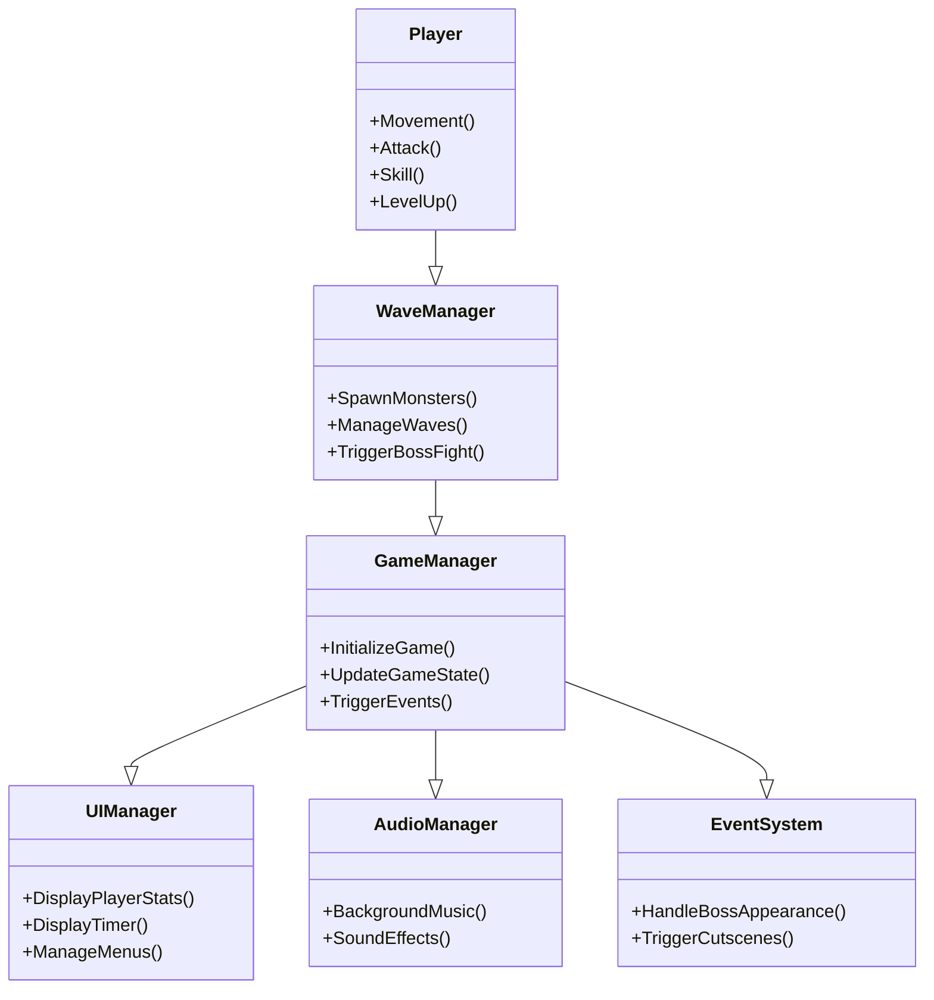

```mermaid
classDiagram
    class Player {
        +Movement()
        +Attack()
        +Skill()
        +LevelUp()
    }
    class WaveManager {
        +SpawnMonsters()
        +ManageWaves()
        +TriggerBossFight()
    }
    class GameManager {
        +InitializeGame()
        +UpdateGameState()
        +TriggerEvents()
    }
    class UIManager {
        +DisplayPlayerStats()
        +DisplayTimer()
        +ManageMenus()
    }
    class AudioManager {
        +BackgroundMusic()
        +SoundEffects()
    }
    class EventSystem {
        +HandleBossAppearance()
        +TriggerCutscenes()
    }

    Player --|> WaveManager
    WaveManager --|> GameManager
    GameManager --|> UIManager
    GameManager --|> AudioManager
    GameManager --|> EventSystem
```
