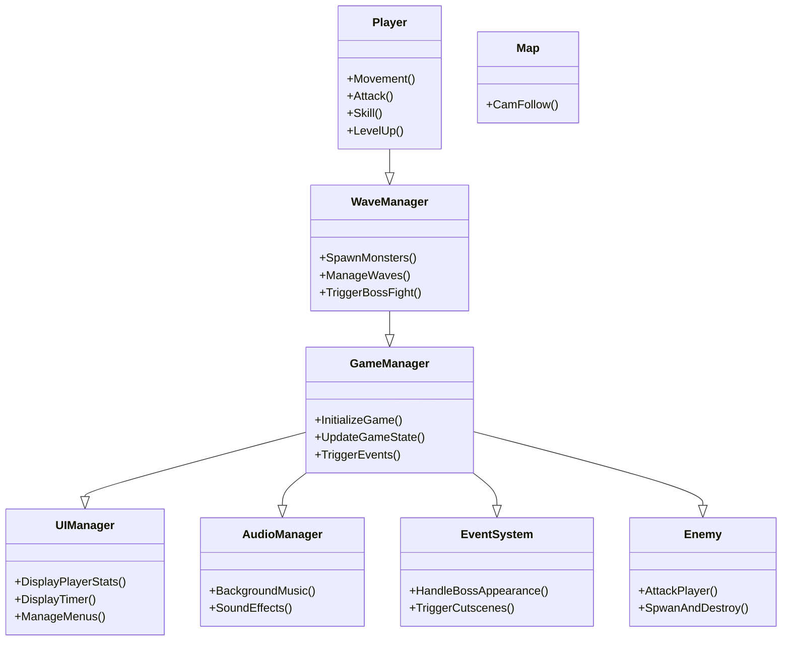

### 요구사항 정리

## 송종익 바보

## Player 클래스
- **책임**: 플레이어 캐릭터의 이동, 공격, 레벨업, 스킬 사용 등 모든 행동을 관리.
- **필요한 기능**:
  - `Movement()`: 캐릭터 이동 처리.
  - `Attack()`: 죽창을 이용한 기본 공격.
  - `Skill()`: 스킬 발동(예: 죽창 회오리).
  - `LevelUp()`: 몬스터 처치 시 경험치 획득 및 레벨업.

## WaveManager 클래스
- **책임**: 웨이브 및 적 스폰을 관리.
- **필요한 기능**:
  - `SpawnMonsters()`: 몬스터를 맵에 스폰.
  - `ManageWaves()`: 웨이브 진행 상태를 관리.
  - `TriggerBossFight()`: 특정 조건에서 보스 전투를 시작.

## GameManager 클래스
- **책임**: 게임의 전반적인 상태와 흐름을 관리.
- **필요한 기능**:
  - `InitializeGame()`: 게임 초기화.
  - `UpdateGameState()`: 게임 상태(플레이 중, 일시 정지 등)를 업데이트.
  - `TriggerEvents()`: 게임 내 이벤트를 실행.

## UIManager 클래스
- **책임**: 게임 화면의 UI를 관리.
- **필요한 기능**:
  - `DisplayPlayerStats()`: 플레이어의 체력, 레벨 등 정보를 표시.
  - `DisplayTimer()`: 남은 시간 또는 웨이브 타이머 표시.
  - `ManageMenus()`: 메뉴(일시 정지, 재시작 등)를 관리.

## AudioManager 클래스
- **책임**: 게임의 배경음악 및 효과음을 관리.
- **필요한 기능**:
  - `BackgroundMusic()`: 배경음악 재생 및 제어.
  - `SoundEffects()`: 효과음 재생.

## EventSystem 클래스
- **책임**: 주요 이벤트(컷씬, 보스 등장 등)를 관리.
- **필요한 기능**:
  - `HandleBossAppearance()`: 보스 등장 연출.
  - `TriggerCutscenes()`: 컷씬 실행.

## Enemy 클래스
- **책임**: 몬스터의 기본적인 기능
- **필요한 기능**:
   - AttackPlayer() : 플레이어를 찾아서 공격
   - SpwanAndDestroy() : 몬스터 리젠과 파괴
      
